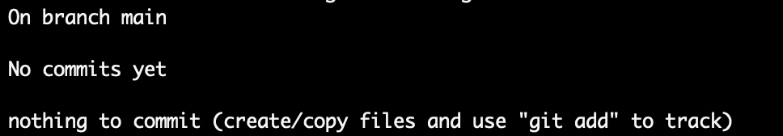
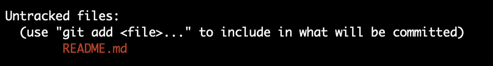
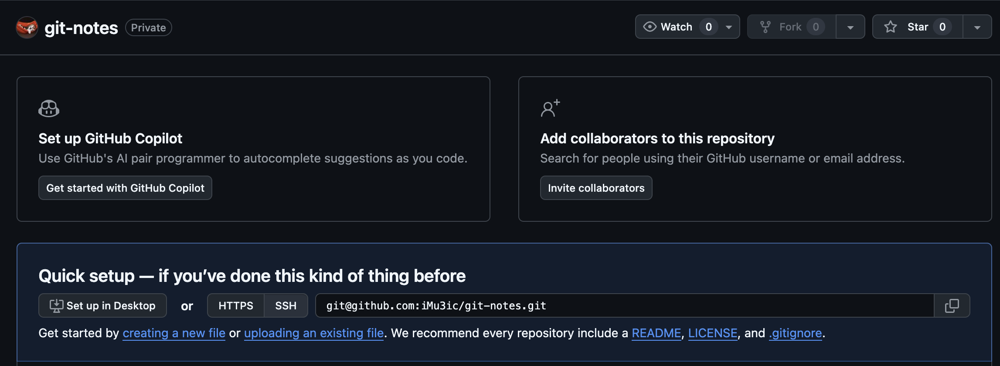

Этот репозиторий содержит заметки по работе с Git
-------------------------------------------------
### Создание локального репозитория

1. Создать каталог будущего репозитория и перейти в него
```bash
mkdir <имя_репозитория> && cd <имя_репозитория>
```
2. Инициализировать репозиторий
```bash
git init
```
Локальный репозиторий готов для работы.

3. Проверить статус репозитория можно так
```bash
git status
```
Вы увидите такой результат. Это означает, что в репозиторий еще ничего не добавлено.



### Добавления файлов проекта в локальный репозиторий

1. Создать файлы можно так
```bash
touch <имя_файла1> <имя_файла2>
```
2. Далее, внести в них необходимые изменения
3. Проверить статус.

Git сообщит, что в каталоге репозитория содержатся файлы, для которых не ведется отслеживание.



4. Добавить файлы и изменения для отслеживания можно одним из следующих способов
```bash
git add .                         // добавит текущий каталог
git add --all                     // добавит все изменения для отслеживания
git add <имя_файла1> <имя_файла2> // добавит файлы по очереди
```
5. После проверки статуса все изменения будут добавлены


6. После того, как все изменения зафиксированы, для сохранения файлов следует сделать коммит
```bash
git commit -m 'Мой первый коммит!'
```
Текст сообщения коммита должен быть понятным и пояснять, какие изменения были сделаны в репозитории.

7. Посмотреть всю историю коммитов, находясь в каталоге с репозиторием, можно с помощью команды
```bash
git log
```

### Создание удаленного репозитория на Github

1. На странице профиля пользователя, на вкладке _"Repositories"_, нажать на кнопку _"New"_


2. В появившемся окне в поле названия репозитория указать имя, идентичное как у каталога с локальным репозиторием: **<имя_репозитория>**

3. Далее, все можно оставить как есть и нажать на кнопку _"Create repository"_

### Связывание локального и удаленного репозитория

1. На странице профиля пользователя, на вкладке _"Repositories"_, необходимо перейти на страницу вновь созданного репозитория



2. Скопировать ссылку на репозиторий

3. В терминале перейти в папку локального репозитория

4. Далее выполнить команду

```bash
git remote add origin <URL_репозитория>
```
URL репозитория может быть HTTPS- или SSH-вида, в зависимости от того, добавляли ли ранее SSH-ключ.

Здесь origin - это имя репозитория. Для удаленного репозитория всегда указываем это имя.

5. Отправить локальные изменения на удаленный репозиторий

```bash
git push -u origin main
```
Флаг -u свяжет ветку main локального репозитория с веткой main удаленного репозитория, как мы ранее связывали сами репозитории.

6. Проверить связность можно командой

```bash
git remote -v (или --verbose)
```
Будут выведены строчки, похожие на: <br>
origin	git@github.com:iMu3ic/git-notes.git (fetch) <br>
origin	git@github.com:iMu3ic/git-notes.git (push)

### Проверка работы

1. Внести в один из ранее созданных файлов в локальном репозитории изменения
2. Добавить эти изменения для отслеживания
```bash
git add <имя_файла>
```
3. Сделать коммит изменений в локальный репозиторий
```bash
git commit -m "Мои первые изменения и мой второй коммит!"
```
4. Отправить изменения на удаленный репозиторий
```bash
git push
```
5. На странице репозитория на [Github](https://github.com "Адрес Github") перейти проверить наличие внесенных изменений.

### Хеш - идентификатор коммита

1. Информация о коммите - это следующая информация:
  * когда был сделан коммит,
  * содержимое файлов в репозитории на момент коммита,
  * ссылка на предыдущий коммит.

2. Git хеширует информацию о коммите с помощью SHA-1

3. Хеш - это основной идентификатор коммита
Если знать хеш, можно узнать и все остальное: автора и дату коммита, содержимое файлов на момент коммита

4. Git хранит все хеши и таблицу соответствий хеш -> информация о коммите в каталоге .git

### Важное про git log

1. Сокращенный лог можно позвать командой, в нем выведутся сокращенные хеши

```bash
git log --oneline
```

2. В логе пишется хеш коммита, автор коммита, дата коммита и сообщение коммита
